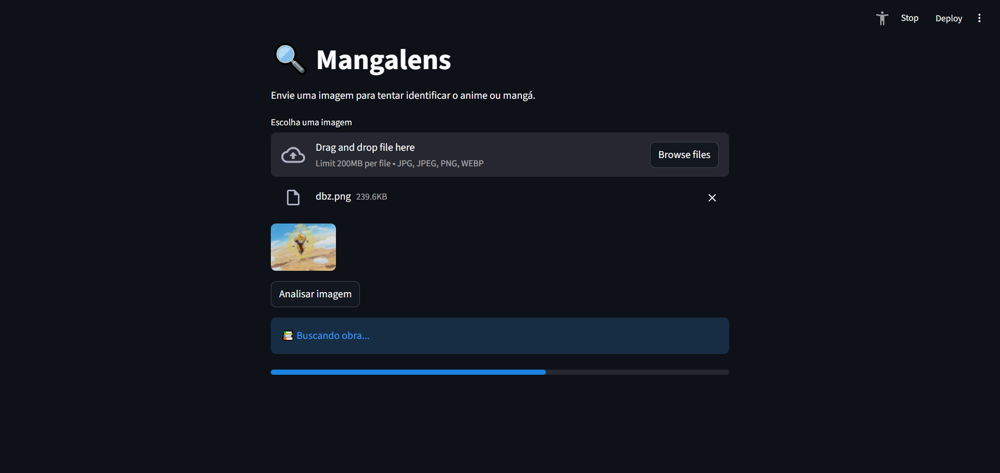
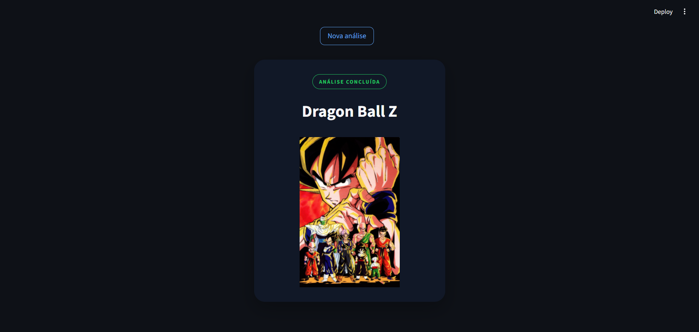

# Mangalens 🎴🔍

O Mangalens é uma aplicação Full Stack focada na identificação de animes e mangás através de imagens, utilizando visão computacional, embeddings e integração com APIs especializadas.

Atualmente o projeto é capaz de identificar:

* Cenas de anime
* Painéis de mangá
* Capas de anime

Após a identificação, o sistema busca automaticamente informações complementares e a capa da obra quando disponível.

O projeto foi desenvolvido com foco em:

* Arquitetura Backend
* Integração com APIs externas
* Processamento de imagens
* Inteligência Artificial aplicada

---

## 🌐 Demonstração Online

https://mangalens.streamlit.app

# ✨ Demonstração do Projeto

## Upload da imagem

<p align="center">
  
</p>

## Resultado da identificação

<p align="center">
  
</p>

---

# ✨ Funcionalidades atuais

✅ Upload de imagens

✅ Pré-processamento de imagens

✅ Identificação de cenas de anime

✅ Identificação de painéis de mangá

✅ Identificação de capas de anime

✅ Geração de embeddings

✅ Busca por similaridade local

✅ Integração com Trace.moe

✅ Integração com SauceNAO

✅ Integração com AniList

✅ Busca automática de capas

✅ Fallback automático entre APIs

✅ Validação de confiança e similaridade

✅ Interface web desenvolvida com Streamlit

✅ API REST desenvolvida com FastAPI

✅ Documentação automática via Swagger

---

# 🧠 Como funciona

O sistema segue o seguinte fluxo:

```text
Imagem enviada
      ↓
Pré-processamento
      ↓
Consulta ao Trace.moe
      ↓
Consulta ao SauceNAO
      ↓
Validação e comparação dos resultados
      ↓
Busca da capa via AniList
      ↓
Retorno final para a interface
```

---

# 🤖 Inteligência Artificial no projeto

O Mangalens utiliza IA em duas frentes principais:

### 1. Geração de Embeddings

As imagens enviadas são transformadas em vetores numéricos utilizando uma rede neural pré-treinada (ResNet18).

Esses vetores representam características visuais da imagem e permitem comparações por similaridade.

### 2. APIs Especializadas

O projeto utiliza serviços externos que empregam modelos de IA e visão computacional para reconhecer obras a partir de imagens:

* Trace.moe
* SauceNAO

Essas APIs analisam o conteúdo visual da imagem e retornam possíveis correspondências.

---

# 🛠️ Tecnologias utilizadas

## Backend

* Python
* FastAPI
* Uvicorn
* Requests
* Pydantic

## Frontend

* Streamlit

## Processamento de imagem

* Pillow
* PyTorch
* Torchvision

## Inteligência Artificial

* ResNet18
* Embeddings Vetoriais

## APIs externas

* Trace.moe
* SauceNAO
* AniList

---

# 📂 Estrutura do projeto

```text
app/
├── config/
├── integrations/
│   ├── anilist.py
│   ├── saucenao.py
│   └── trace_moe.py
│
├── reference_images/
│
├── routes/
├── schemas/
├── services/
├── uploads/
└── main.py

frontend/
├── components/
│   └── result_card.py
│
├── services/
│   └── api.py
│
└── streamlit_app.py

assets/
├── demo-upload.png
└── demo-result.png
```

---

# 🚀 Como executar o projeto

## 1. Clone o repositório

```bash
git clone URL_DO_REPOSITORIO
```

## 2. Acesse a pasta do projeto

```bash
cd mangalens
```

## 3. Instale as dependências

```bash
pip install -r requirements.txt
```

## 4. Configure o arquivo .env

Crie um arquivo:

```text
.env
```

E adicione:

```env
SAUCENAO_API_KEY=sua_chave_aqui
```

## 5. Execute a API

```bash
uvicorn app.main:app --reload
```

A API estará disponível em:

```text
http://127.0.0.1:8000
```

Swagger:

```text
http://127.0.0.1:8000/docs
```

## 6. Execute o Frontend

```bash
streamlit run frontend/streamlit_app.py
```

---

# 📌 Status do projeto

🚧 MVP funcional em desenvolvimento

### Próximas melhorias

* Aprimoramento da busca local por embeddings
* Expansão da base de imagens de referência
* Suporte avançado para mangás
* Banco próprio de capas
* Deploy em produção
* Melhorias contínuas de UX/UI

---

# 🎯 Objetivos de aprendizado

Este projeto foi criado para aprofundar conhecimentos em:

* Desenvolvimento Backend
* Desenvolvimento Frontend
* Integração com APIs
* Processamento de imagens
* Inteligência Artificial aplicada
* Arquitetura de Software
* Desenvolvimento Full Stack

---

# 👨‍💻 Autor

**Nicolas Moraes**

Projeto desenvolvido para fins de estudo, prática e composição de portfólio.
